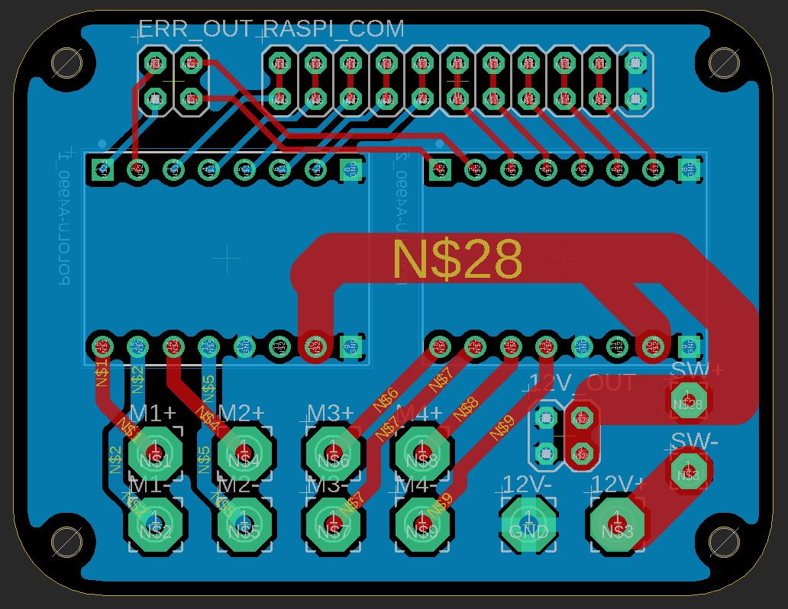
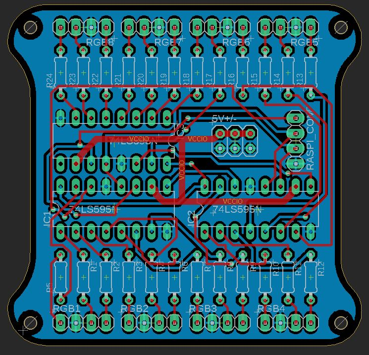
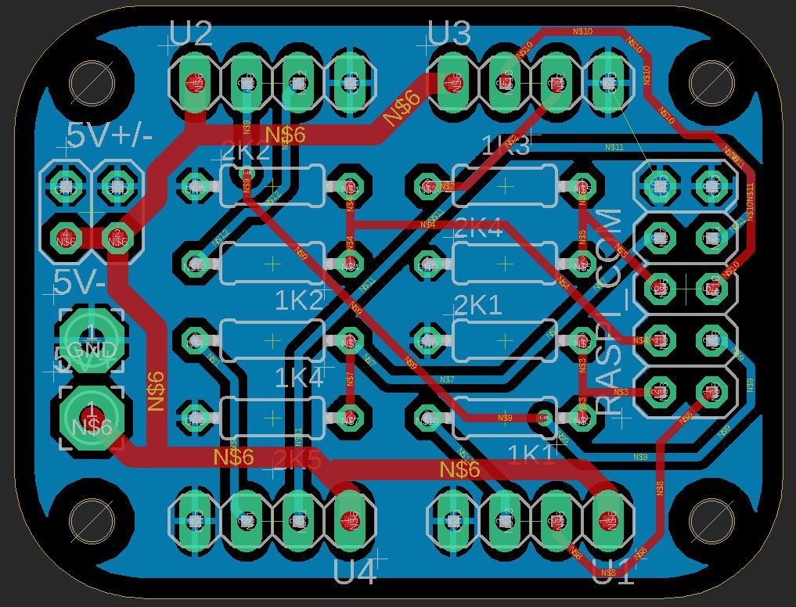

# Umnitsa Custom PCB Designs
Each folder contains the Eagle PCB schematic and board layout as well as the gerber files.

## UmnitsaControl
UmnitsaControl is the PCB for the motor control of four DC 12 V motors using two
Pololu-A4990 Motor Driver Carriers. Rated for 1.0 Amp for each motor and 2.5 Amp total.  
**Inputs:** 12 V supply, RasPi 10 control inputs  
**Outputs:** 12 V pins, 4 Motor Outputs, A4990 error pins (optional)  

## UmnitsaRGB
UmnitsaRGB is used to control 8 RGB LEDs with only 3 pin inputs from the RasPi by using
three HC595 shift registers.  
**Inputs:** 5 V supply, RasPi 3 control inputs  
**Outputs:** 5 V pins, 8 RGB LED Outputs  

## UmnitsaUltrasonic
UmnitsaRGB is used to receive data from four HC-SR04 ultrasonic sensors.  

**Inputs:** 5 V supply, RasPi control inputs  
**Outputs:** 5 V pins, 4 HC-SR04 inputs/outputs  

